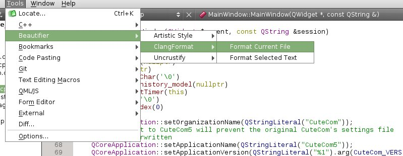
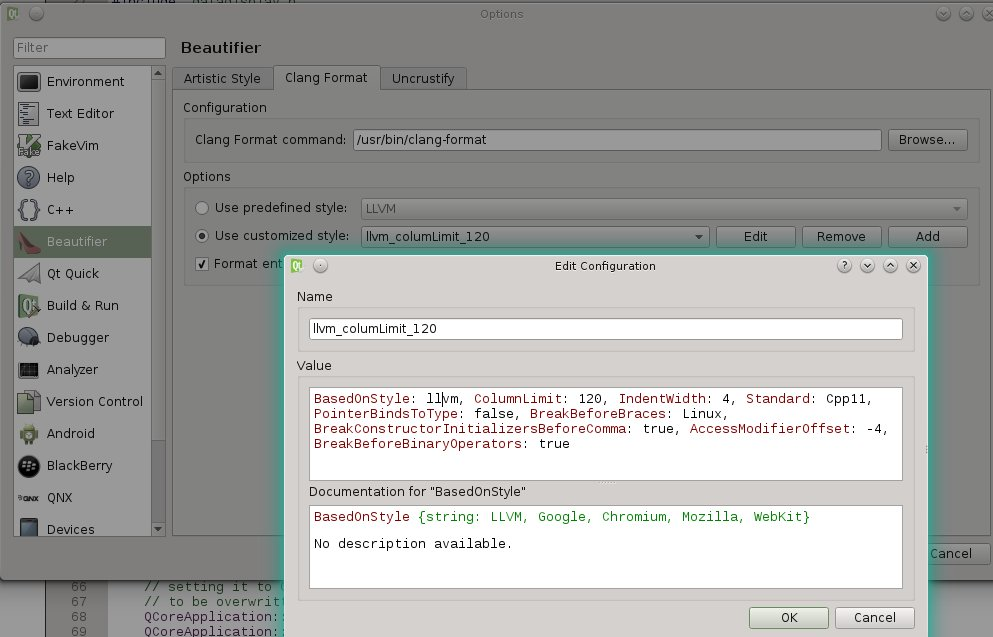

## Contributing

Pull requests are welcome.

### Consistent Formatting

CuteCom is being developed with a code styleguide in place since I 
believe that a consisten coding style is important.
To achive that, clang-format is beeing used.
For a great talk on that you may want to watch this video
https://www.youtube.com/watch?v=s7JmdCfI__c

Before you create a pull request, please make sure the code adheres 
to the style.

```
BasedOnStyle: llvm, ColumnLimit: 120, IndentWidth: 4, Standard: Cpp11,
PointerBindsToType: false, BreakBeforeBraces: Linux,
BreakConstructorInitializersBeforeComma: true, AccessModifierOffset: -4,
BreakBeforeBinaryOperators: true
```

You may do so by using the Qt Creator beautifier 

### Qt Creator Beautifier




### clang-format on CLI
**ToDo
Describe how clang-format is being used on the CLI.

