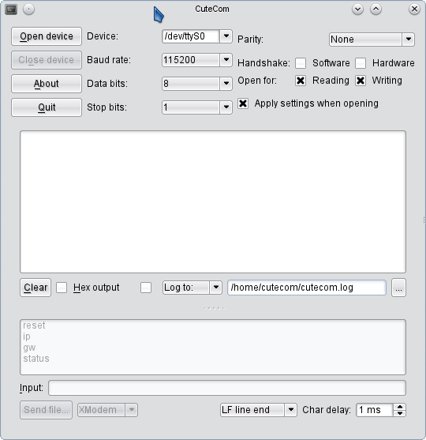

## Welcome to _CuteCom_

CuteCom is a graphical serial terminal, like minicom. 
Currently it runs on Linux (tested) and should run on FreeBSD, Mac OS X and maybe other systems as well (untested).  
It is aimed mainly at hardware developers or other people who need a terminal to talk to their devices. 
It is free software and distributed under the GNU General Public License Version 3. 
It is written using the [Qt library](http://www.qt.io/) originally created by Trolltech.

### History

The current CuteCom-version has being reimplemented using Qt 5 switching to the now available QSerialport.
The GUI was facelifted and amongst other features a session support was added.
Session support comes in handy if you have two or more devices connected, each of it talking 
in different baudrates or other connection parameters. The command history is stored for each individual session since
different devices may provide a different set of commands.
Features enhancements of various forks have been included see [**_CREDITS_**](CREDITS) for a complete list.
Version 0.30.0 is the first public release after the reimplementation.

### Features:

*   easy to use GUI
*   no cryptic keyboard shortcuts
*   lineoriented interface instead of character-oriented
*   Ctrl+C, Ctrl+Q and Ctrl+S control sequences work
*   input history
*   a cute GUI ;-)
*   session support via -s <session name> specified at the command line
*   switching sessions via a session manager
*   control panel hides when not used 
*   xmodem, ymodem, zmodem support (requires the sz tools)
*   easy to differentiate between typed text and echoed text
*   select between read/write, read-only and write-only open mode
*   hexadecimal input and output
*   configurable line end characters (LF, CR, LFCR)
*   configurable delay between characters
*   optionally show control characters like line feed or tabs in output
*   optionally prefix each line in output with a timestamp
*   open the device without changing its settings (was not ported but could be added if demand arrises )

### Build instructions

On Linux you will hopefully find ready made packages using the package manager of your distribution.
To build your own copy, you need to run `cmake .` followd by make.
You'll then find a cutecom binary in the same folder.
`make package` should provide you with a generic RPM package (which lacks the documentation and the like).
`make dist` creates a tar ball (so does `make package_source`)

#### Requirements for Building:

*   CuteCom 0.30.0 +: Qt >= 5.1, CMake >= 2.8.11
*   on linux look for the qt5 development packages including QSerialport
*   Since C++C11 features are used a gcc supporting these is needed too

## Changelog

Here is the complete [**_Changelog_**](Changelog).  

**_Current state:_** stable

**_TODO_ **:

*   searching in the output view via context menu and Ctrl+F shortcut
*   translations
*   show control characters in a different colour
*   selectable style for the output view like green on black including
*   font selection for the output view

As always:
**Pull requests are welcome ! :-)**

### Screenshot

Ok, here comes the inevitable screenshot:  

The control panel for adjusting the device settings slides out when pressing the Settings button.
At the upper half, commands issued are accumulated. 
Commands may be selected from the history using up and down arrow keys.'
Right below command line situated right in the middle, the output view can be found.
It will autoscroll to the end of the date sent from the connected device.
Autoscolling will stop, once a certain section of the data is scrolled to.
PageUp and PageDown are working for moving through the output view.

## Previous versions:

**_Previous version (uses Qt4):_** [cutecom-0.22.0.tar.gz,](http://cutecom.sourceforge.net/cutecom-0.22.0.tar.gz) , June 27th, 2009
(yes, it's really only 22kb). Now also works on Mac OSX and supports more baud rates.  

For older versions have a look at the SourceForge project page.

CuteCom was heavily inspired by [Bray++ Terminal for Windows](https://sites.google.com/site/terminalbpp/).

